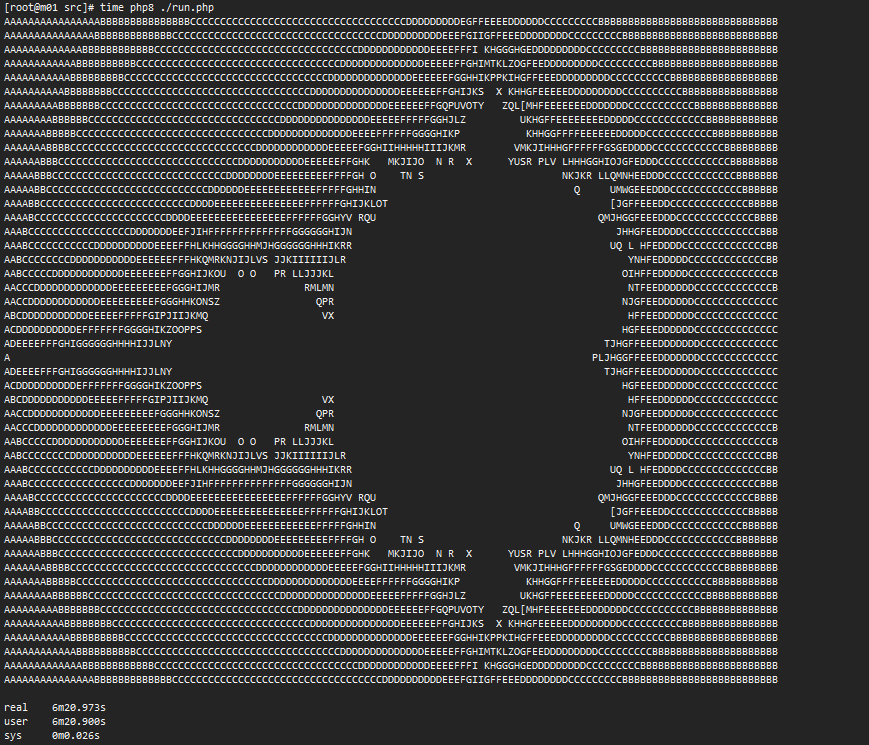
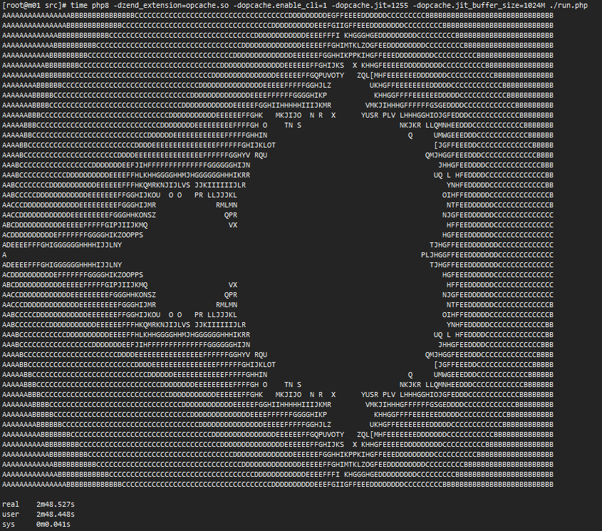

README.md
---------

# PHP8 Benchmark the Brainfuck Way

PHP8 已经发布了, 带来了全新的, 令人兴奋的 JIT 编译引擎. 根据官方文档描述: "它在综合基准测试中的性能提高了大约 3 倍, 在某些特定的长期运行的应用程序中提高了 1.5-2 倍. 典型的应用程序性能与 PHP 7.4 相当.".  

官方性能测试结果如下图:  


# 那么实际情况如何?

于是我写了个简单的跑分 [demo](./src/run.php), 是一个从 Go 语言移植过来的 [brainfuck 语言](https://zh.wikipedia.org/wiki/Brainfuck) 解释器. 

源码见: [run.php](./src/run.php). 里边顺便还包含了 brainfuck 实现的 [曼德博集合(Mandelbrot set)](https://zh.wikipedia.org/wiki/%E6%9B%BC%E5%BE%B7%E5%8D%9A%E9%9B%86%E5%90%88). 程序即用 PHP 编写的 brainfuck 语言解释器运行 brainfuck 编写的生成曼德博集合的程序. 然后计时并比较其性能.  

我的机器配置为: Intel(R) Xeon(TM) E5-2680v2 @2.8GHz.

### PHP 8.0.0 没有开启J IT 测试结果



### PHP 8.0.0 开启 JIT 测试结果


# 结论

从测试数据看, 未开启 JIT 耗时 6m20.973s, 开启 JIT 耗时 2m48.527s. 单从这一测试结果讲, 性能提升了 2.26 倍. demo 程序大部分时间都在做 ```$foo++;```, ```$foo--;```, 数组查找并赋值这样的操作, 其中最多的 ```op_inc_dp``` 逻辑, 即 ```$dataPtr++;``` 执行了 4,453,036,023 次.  

| operator executed in executeBf | execute times    |
|--------------------------------|------------------| 
| op_inc_dp                      |  int(4453036023) |
| op_dec_dp                      |  int(4453036013) |
| op_inc_val                     |  int(179053599)  |
| op_dec_val                     |  int(177623022)  |
| op_out                         |  int(6240)       |
| op_in                          |  int(0)          |
| op_jmp_fwd                     |  int(422534152)  |
| op_jmp_bck                     |  int(835818921)  |

就本次测试结果而言, PHP 8 引入了 JIT 的性能提升是显著的. 这为 PHP 带来了新的可能性. 但同时我们也看到官方测试中, 一些复杂的应用 (比如WordPress) 提升很微弱. 目前还不知道是因为 JIT 仍处于初期阶段导致性能提升不显著, 还是因为 WordPress 由于是既存项目, 代码不可能为 JIT 专门优化过而导致性能提升不明显. 这部分还需要通过详细的 benchmark (比如使用火焰图) 来进行研判.

作为一个从 PHP 4 一路使用过来的老用户, 对 PHP 的感情是复杂的, PHP 现在十分缺乏一个强力的生态来重新唤醒. 而这需要广大 PHPer 的共同努力. 期待未来 PHP 能有更好的表现.

# Reference
- [The Original brainfuck interpreter source code](https://github.com/kgabis/brainfuck-go/blob/master/bf.go)
- The mandelbrot set fractal viewer in brainfuck written by Erik Bosman

# Author
- @karminski contributed to PHP, Lua benchmark scripts
- @hubo1016 contributed to JavaScript, Python benchmark scripts

Thanks guys.

# License
- [The MIT License (MIT)](http://opensource.org/licenses/mit-license.php)

